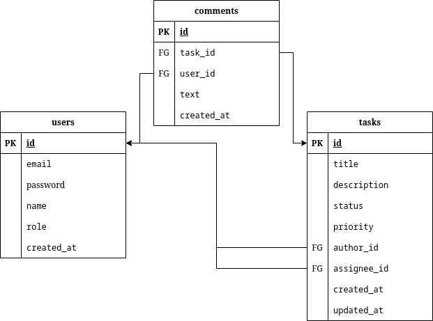

# Task Management System

## Описание проекта

**Task Management System** — это RESTful API для управления задачами, реализованное с использованием Java, Spring Boot, Spring Security, Spring Data и PostgreSQL. Система поддерживает создание, редактирование, удаление и просмотр задач, управление пользователями с ролями (администратор и пользователь), аутентификацию с использованием JWT, а также хранение комментариев к задачам.

---

## Основные функции

- **Управление задачами**: создание, редактирование, удаление, назначение приоритета и статуса.
- **Управление комментариями**: добавление комментариев к задачам.
- **Управление пользователями**: регистрация пользователей, аутентификация через JWT, разграничение доступа на основе ролей (администратор или пользователь).
- **Пагинация и фильтрация задач**.
- **Документация API**: Swagger UI.

---

## Основные технологии проекта
1. **Java 17**: Основной язык разработки.
2. **Spring Boot 3.3.5**: Фреймворк для упрощенной разработки серверных приложений. В проекте применяются модули Spring Boot:
  - `spring-boot-starter-web`: Создание REST API и работа с HTTP-запросами.
  - `spring-boot-starter-aop`: Поддержка аспектно-ориентированного программирования (AOP) для логирования и других аспектов.
  - `spring-boot-starter-jpa`: Подключение к базе данных с помощью JPA.
3. **Spring Security**: Фреймворк для аутентификации пользователя.
4. **Spring Data**: Фреймворк для работы с базой данных.
5. **Flyway**: Инструмент миграции базы данных, позволяющий управлять версионированием и изменениями в схеме данных.
6. **Lombok**: Аннотации, снижающие объем шаблонного кода, упрощая процесс создания POJO-классов.
7. **SpringDoc OpenAPI**: Автоматическая генерация документации Swagger, позволяет просматривать и тестировать эндпоинты.
8. **JUnit5 и Mockito**: Наборы для модульного тестирования.
  - `junit-jupiter-engine`: Библиотека для юнит-тестов.
  - `mockito-junit-jupiter` и `mockito-inline`: Для создания заглушек (mock) и проверки логики в тестах.
9. **SLF4J**: Интерфейс для логирования, используемый для работы с журналами событий.
10. **Java JWT**: Библиотека для работы с JWT-токенами, что позволяет добавлять безопасность и управление сессиями пользователей.
11. **Docker Compose**: Контейнер с PostgreSQL. Конфигурация в `docker-compose.yml`.
12. **MapStruct**: Генерация кода для преобразования DTO и других объектов, что упрощает процесс работы с объектами.
13. **PostgreSQL**: База данных, используемая для хранения данных приложения.
14. **Maven**: Инструмент для управления зависимостями и сборки проекта.
15. **Собственный стартер LoggingAspect предназначен для: Логирования методов, вызываемых в репозиториях, сервисах и контроллерах.
  Работает без объявления аннотации.

--- 

## Запуск:
1. Клонируйте репозиторий

```shell
git clone https://github.com/levchig737/taskManagementSystem.git && cd taskManagementSystem
```

2. Создание контейнера PostgresSql

```shell
docker-compose up -d
```

3. Скомпилируйте проект с помощью Maven

```shell
mvn clean compile
```

4. Запустите приложение

```shell
mvn spring-boot:run
```

## Запросы
Доступ по ссылке: http://localhost:8080/

---

## Архитектура базы данных

База данных построена на основе PostgreSQL. В проекте используются три основные таблицы:

1. **users** (Пользователи)
2. **tasks** (Задачи)
3. **comments** (Комментарии)

### Отношения между таблицами:
- **User ↔ Task**:
    - Один пользователь может быть автором или исполнителем множества задач.
    - Задача всегда связана с автором (`author_id`), исполнитель (`assignee_id`) может быть NULL.
- **Task ↔ Comment**:
    - Одна задача может иметь множество комментариев.
    - Комментарий всегда связан с задачей и пользователем (автором комментария).

---

### Реляционная модель базы данных


### Доступные пользователи (Таблица users):
| id | email              | password | name       | role  |
|----|--------------------|----------|------------|-------|
| 1  | admin@example.com  | admin    | Admin User | ADMIN |
| 2  | user1@example.com  | user1    | User One   | USER  |
| 3  | user2@example.com  | user2    | User Two   | USER  |

---

### Доступные задачи (Таблица tasks):
| id | title    | description           | status       | priority | author_id | assignee_id |
|----|----------|-----------------------|--------------|----------|-----------|-------------|
| 1  | Task 1   | Description for Task 1| PENDING      | HIGH     | 1         | 2           |
| 2  | Task 2   | Description for Task 2| IN_PROGRESS  | MEDIUM   | 1         | 3           |
| 3  | Task 3   | Description for Task 3| COMPLETED    | LOW      | 2         | NULL        |

---

### Доступные пользователи (Таблица comments):
| id | task_id | user_id | text                             |
|----|---------|---------|----------------------------------|
| 1  | 1       | 2       | Comment for Task 1 by User 2    |
| 2  | 2       | 3       | Comment for Task 2 by User 3    |
| 3  | 3       | 2       | Comment for Task 3 by User 2    |
